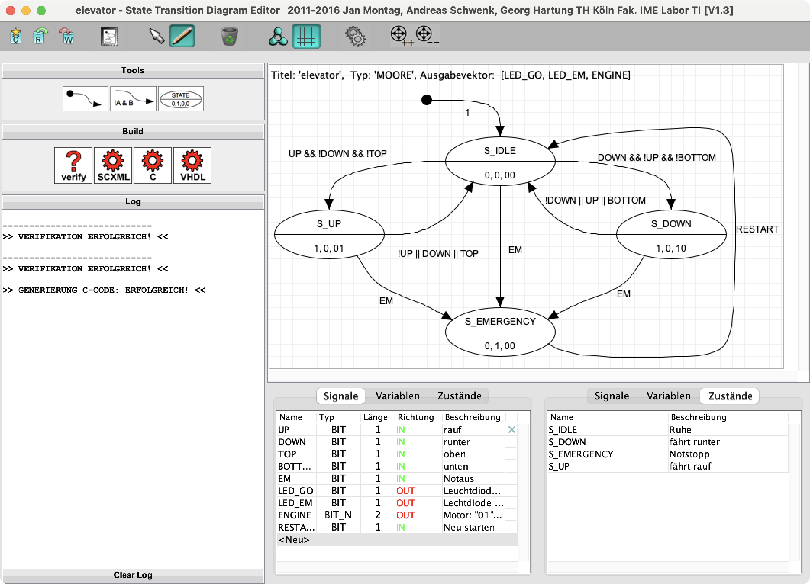

# STDE-classic

Classic Java implementation of the State Transition Diagram Editor (STDE), developed as a student project and used in teaching for approx 15 years. Preserved for reference and historical context. 

Although this project is licensed under the MIT License, I would appreciate being informed about its use, and likewise if derivative works reference this repository. Contact: schwenk@member.fsf.org

## Usage

The executable file `STDE.jar` is located in the `dist/` directory and can be started using:

```bash
java -jar STDE.jar
```

The current revision of the user manual (German only) can be found in `docs/`.

Example state machines are provided in `examples/`.

The project can be rebuilt using the supplied `./build.sh` script.

The implementation, including image resources, is located in `src/`.

## Authors

This software was developed as part of a student project. The main implementation was created by Andreas Schwenk and Jan Montag between 2011 and 2012.

> Thanks to Prof. Georg Hartung (TH Köln) for the project idea and supervision, as well as for his long-term effort in using this tool in his lectures over many years, and for providing bug fixes and extensions.

All contributors are acknowledged here to preserve the historical context of the work.

## License

This project is released under the MIT License. See the LICENSE file for full details. Although the license permits unrestricted use, modification, and redistribution, I would appreciate being informed about its use and if derivative works reference this repository.

## Screenshot


